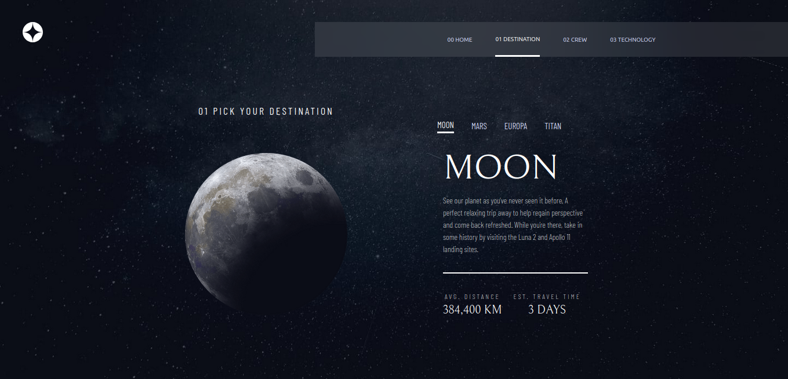

# Frontend Mentor - Space tourism website solution

This is a solution to the [Space tourism website challenge on Frontend Mentor](https://www.frontendmentor.io/challenges/space-tourism-multipage-website-gRWj1URZ3).

## Table of contents

- [Overview](#overview)
  - [The challenge](#the-challenge)
  - [Screenshot](#screenshot)
  - [Links](#links)
- [My process](#my-process)
  - [Built with](#built-with)
  - [What I learned](#what-i-learned)
  - [Continued development](#continued-development)
- [Author](#author)

## Overview

### The challenge

Users should be able to:

- View the optimal layout for each of the website's pages depending on their device's screen size
- See hover states for all interactive elements on the page
- View each page and be able to toggle between the tabs to see new information

### Screenshot



### Links

- Live Site URL: [Live Site URL](https://joramirjr.github.io/space_tourism_website/)

## My process

- I wanted to learn some new tech in the process, so I initially chose a new front-end framework for the creation of the UIs; I ended up choosing Svelte/Svelte Kit for the job. I also made use of TailwindCSS for styling. After choosing the initial tech stack, I followed a mobile-first approach to create the interfaces; initially, I set up the raw UI components, and, overtime, I added styling, to then worry about interactivity, mainly using Svelte's reactice statements

### Built with

- [Svelte](https://svelte.dev/)
- [SvelteKit](https://kit.svelte.dev/)
- [TailwindCSS](https://tailwindcss.com/)
- Semantic HTML5 markup
- CSS custom properties
- Flexbox
- CSS Grid
- Mobile-first workflow

### What I learned

For the first time, I used a framework other than ReactJS to build the frontend; it was quite a nice experience, by working with Svelte/SvelteKit; the simple reactive nature of state changes in Svelte feels way simpler than equivament examples in React; no need for hooks, like useEffect, as we can, in simpler ways, subscribe for state changes; the code below is an example of a really nice feature of Svelte, reactice statements: 

```js
   $: {
      switch (selected_tech) {
         case "vehicle":
            tech_name =  technology[0].name;
            tech_description = technology[0].description
         break;
         case "capsule":
            tech_name =  technology[1].name;
            tech_description = technology[1].description
         break;
         case "port":
            tech_name =  technology[2].name;
            tech_description = technology[2].description
         break;
      }
   }
```

In the block of code above, "selected_tech" represents previously created state variable, making it a "rerun trigger" for the block of code between curly-braces;

### Continued development

I'll be continuing on using Svelte for my projects; I'll also work on my CSS transitions/translations/transformations skills, as, regarding the hover effect on the "explore" button, I had a really hard time creating a precise animation.

For this project, I plan on adding a few extra things, like [JSDoc](https://jsdoc.app/) for type checking, and [ThreeJS](https://threejs.org/) to create 3D planet animations for the "destination" screen

### Useful resources

## Author

- Frontend Mentor - [@JoramirJr](https://www.frontendmentor.io/profile/JoramirJr)
